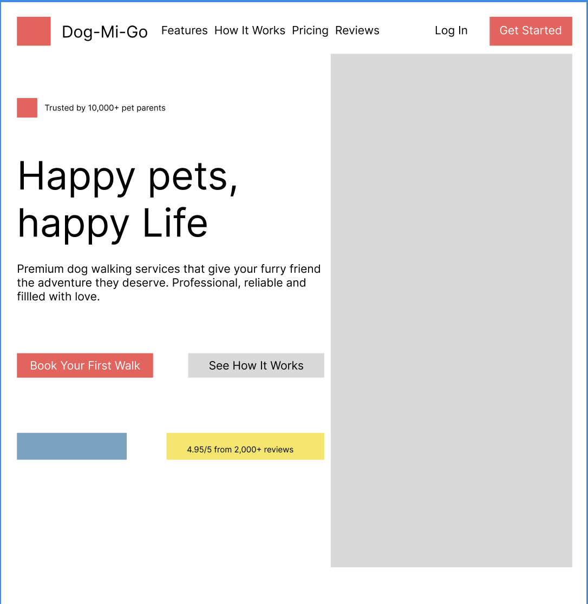
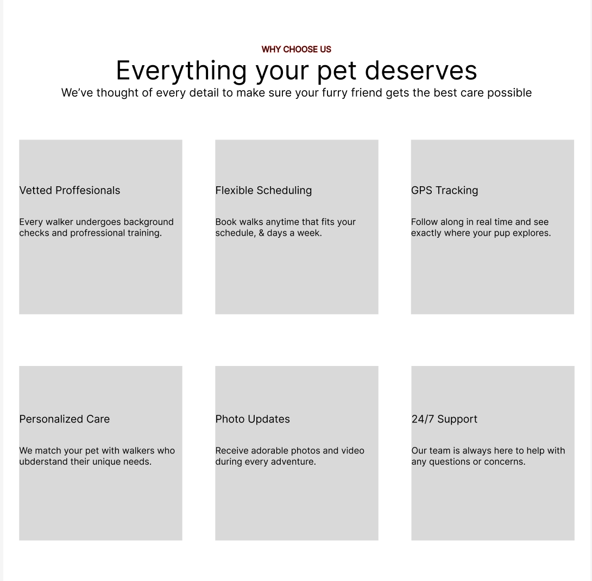
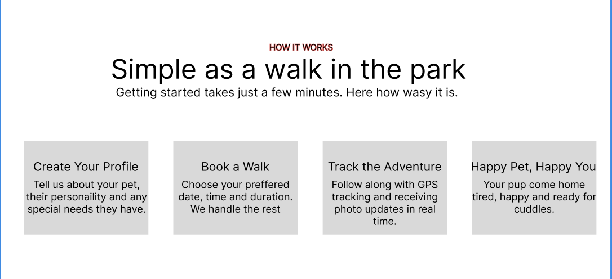
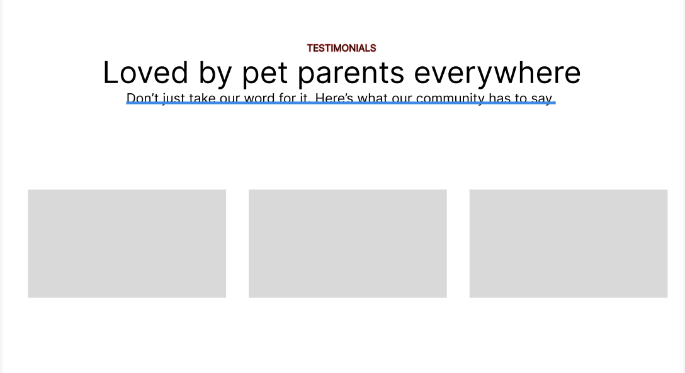
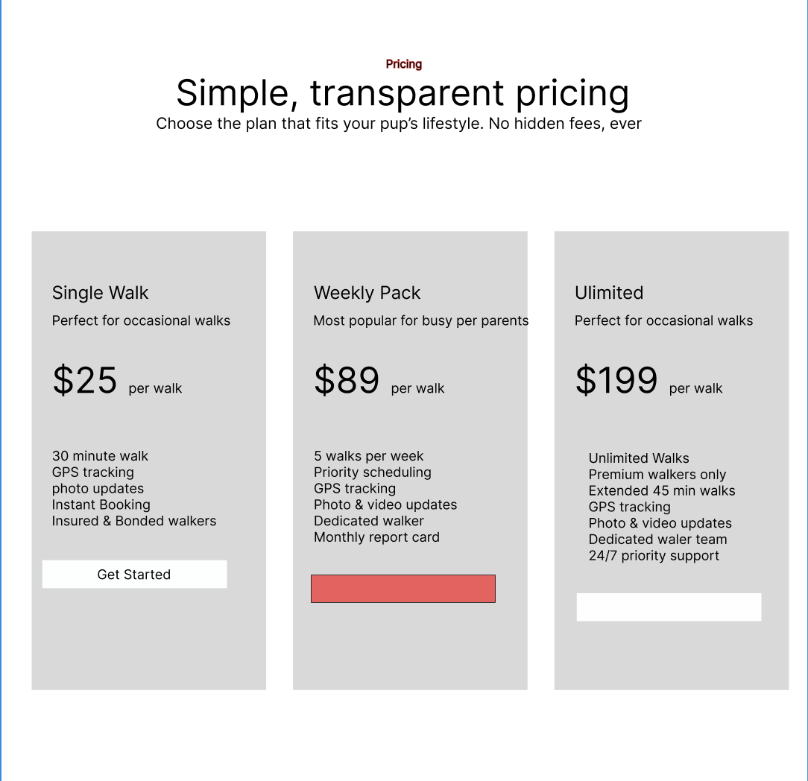
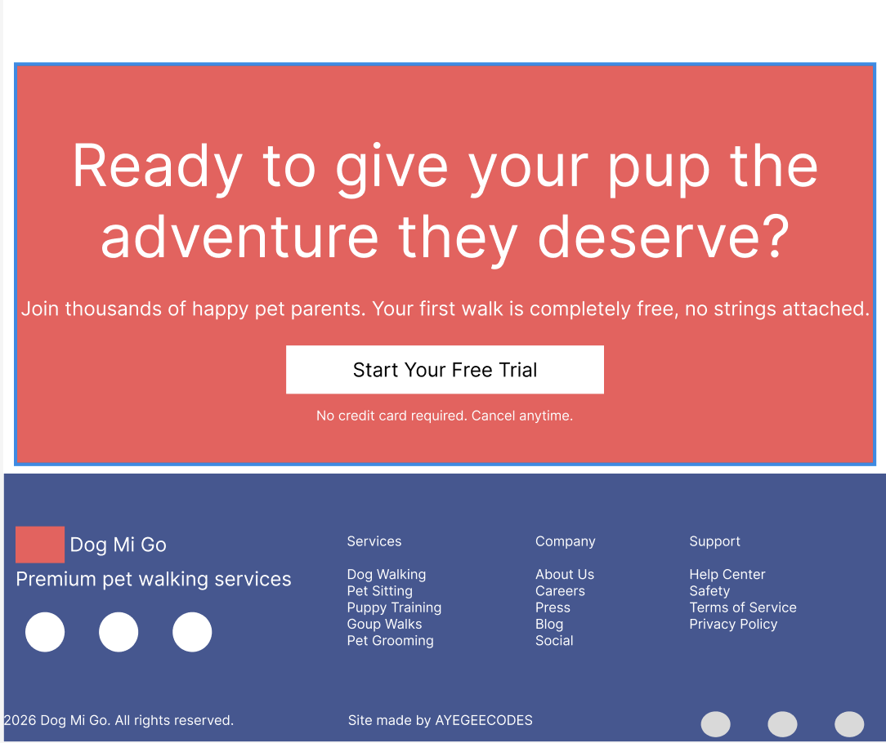

# DogMiGo Professional Landing Page

A professional static landing page for a dog walking company.

👉 [View the live site](#)
<br>

## Figma Spec Sheet







## About This Project

This project was created to showcase my ability to apply responsive design with <code>HTML</code> structure and <code>SCSS</code> styling.   

## Tech Stack
- HTML5
- Sass
- Git / GitHub / Netlify
- Figma
- Google fonts
- NPM
- VS Code

## Features
### Responsive Design
- Apply responsive design to applications using <code>grid</code> layouts that adapt from 1-2 columns to 3-4 columns.
- Alter elements at different screen sizes.
- Flexible spacing with <code>box-size</code>.
### Sass Styling
- Custom color palletes with [www.coolore.co](https://coolors.co/).
- Gradient backgrounds and blur effects.
- **Modules** & **Mixins**.
- Utility variables to reuse throughout your stylesheet.
- Hover states and transitions
### UI Components
- Pre built components with variants.
- Consistent design system.
### Visual Effects
- Backdrop blur for *glassmorphism*.
- Layered backgrounds with opacity.
- Shadow effects for depth.
- Rounded corners and modern aethetics.

This page is fully fuctional without any backend. It's static.

## Installation

Steps to run the project locally:
```
git clone https://github.com/AdantaGriffin/portfolio26.git
cd project-name
npm install
npm start
```

## What I Learned
## Future Improvements
## License
